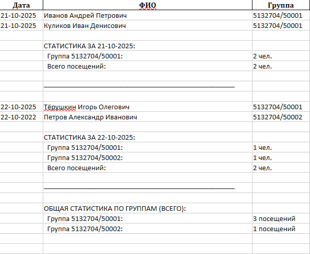
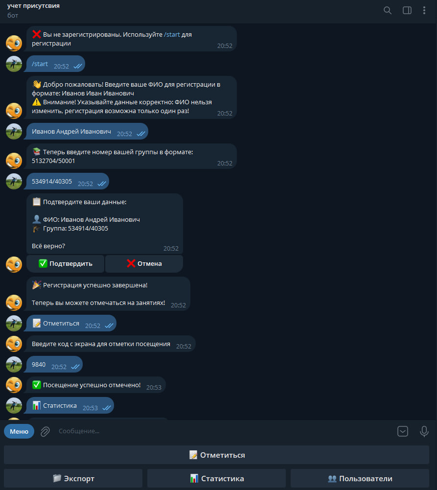
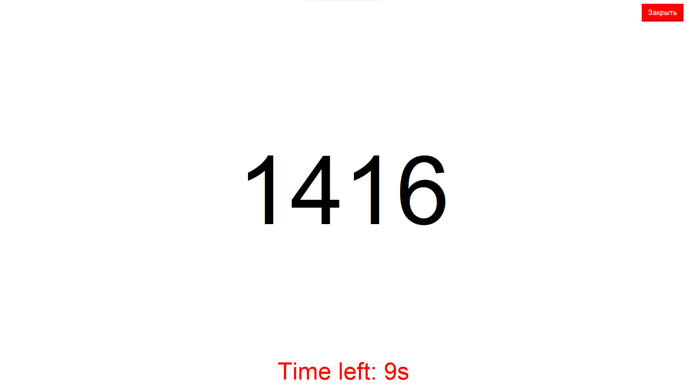

# Telegram-бот для учета посещаемости студентов

Этот проект - Telegram-бот для автоматизированного учета посещаемости студентов. Студенты регистрируются, отмечаются по временным кодам (генерируемым в реальном времени), а администраторы могут экспортировать данные в Excel, просматривать статистику и управлять пользователями. 

Дополнительно есть GUI-приложение (на Tkinter), которое отображает текущий код на экране (например, для проектора в аудитории). Коды обновляются каждые N секунд (настраивается).

## В проекте присутствует:
- Асинхронное программирование (aiogram, asyncio)
- Генерация и валидация кодов
- Работа с БД (SQLAlchemy + async SQLite)
- Экспорт данных в Excel (pandas, openpyxl)
- Простой GUI (Tkinter)

## Функции
- **Регистрация студентов**: Ввод ФИО и группы, проверка уникальности.
- **Отметка посещения**: Студенты вводят код с экрана
- **Админ-панель**: Экспорт посещаемости/пользователей в Excel, статистика за день (по группам, первый отметившийся), управление админами.
- **Команды**: /start, /help, /status, /myid, /admins, /add_admin, /remove_admin, /reset_user, /force_mark.
- **GUI-экран**: Полноэкранное отображение кода с таймером.

## Требования
- Python 3.10+ (проверено на 3.12).
- Зависимости: см. `requirements.txt`.
- Telegram-бот токен (создайте бота через @BotFather).
- Опционально: SQLite для БД (по умолчанию).

## Установка
1. Клонируйте репозиторий:
```
git clone https://github.com/kusti001/attendance_bot.git
cd attendance-bot
```
2. Создайте виртуальное окружение:
```
python -m venv venv
source venv/bin/activate  
# На Windows: venv\Scripts\activate
```
3. Установите зависимости:
```
pip install -r requirements.txt
```
4. Настройте .env:
- Скопируйте `.env.example` в `.env`.
- Заполните переменные:
  - `BOT_TOKEN`: Токен вашего Telegram-бота.
  - `DB_URL`: URL БД (по умолчанию SQLite).
  - `TOTP_INTERVAL`: Интервал обновления кода (секунды, default 20).
  - `ADMIN_IDS`: ID админов через запятую (ваш ID для старта).

## Запуск
- Запустите приложение:
```
python main.py
```
- Это запустит бота в фоне и откроет GUI-экран с кодом.
- Найдите его в Telegram и используйте /start.

## Структура проекта
- `bot/`: Логика бота (handlers, middleware).
- `config/`: Конфигурация.
- `db/`: Модели БД и менеджеры.
- `display/`: GUI для кода.
- `generator/`: Генератор кодов.
- `utils/`: Утилиты (экспорт, админские функции).
- `main.py`: Точка входа.

## Примеры использования
- **Регистрация**: /start → Введите ФИО → Группа → Подтвердите.
- **Отметка**: Кнопка "Отметиться" → Введите код.
- **Экспорт**: Админ нажимает "Экспорт" → Получает XLSX с данными и статистикой.
- **Статистика**: "Статистика" → Показывает посещения за день по группам.

  
*Пример отчета в Excel*


*Пример работы с ботом в Telegram*


*Скриншот экрана с кодом*
